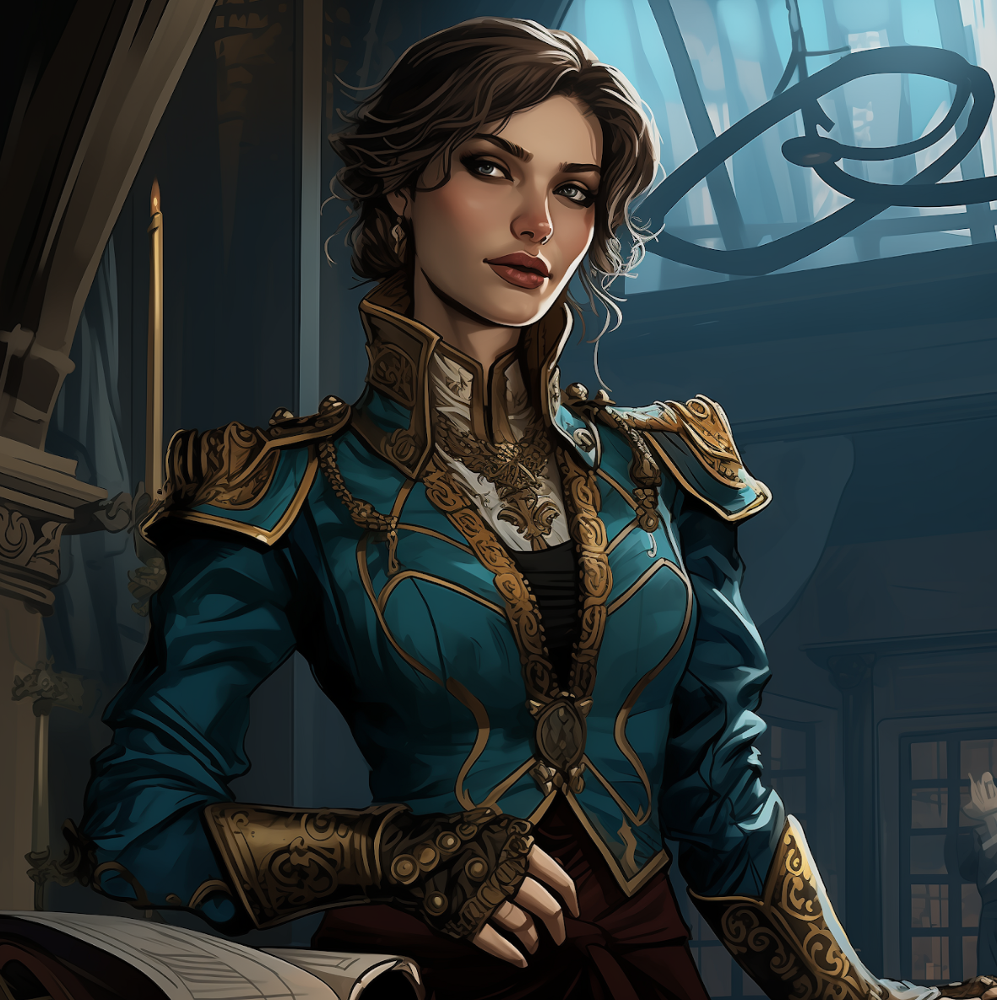

---
cssclasses:
  - pen-red
---
# Aspectum
# :RaBleedingEye:
### Quick Facts

|                    |                                                                                                                                                         |
| ------------------ | ------------------------------------------------------------------------------------------------------------------------------------------------------- |
| First Appearance:  | [Session-5--Dancing-in-Twilight](../-Session-Notes/-1-Gathering-Storms/Session-5--Dancing-in-Twilight.md)                                               |
| Based on:          | -                                                                                                                                                       |
| Played by:         | J                                                                                                                                                       |
| Full name:         | Faalya d'Medani                                                                                                                                         |
| Nicknames:         | Aspectum, Lord of Eyes                                                                                                                                  |
| Gender & Pronouns: | Female, She/Her                                                                                                                                         |
| Ancestry:          | [Khoravar](https://eberron.fandom.com/wiki/Half-elf)                                                                                                    |
| Affiliation:       | [House Medani](https://eberron.fandom.com/wiki/House_Medani) (Former), [The-Looking-Glass](../-Groups/The-Looking-Glass.md) (Former), [Bella](Bella.md) |
| Tarot:             | The Fool                                                                                                                                                |
| Nationality:       | [Brelish](https://eberron.fandom.com/wiki/Breland) (Former)                                                                                             |
***
### General
Mischievous, maniacal, twisted, intelligent, cunning.

***
### History
Faalya worked closely with the Looking Glass.
She tricked the party into collecting a powerful artifact, the hand of the lady of the plague, and revealed her true intentions and servitude to Bella.

***
### Relations
Had an affair with [Rylan](Rylan.md) as a political stunt, both in the Arcanist political party.
Worked with [The Looking Glass](../-Groups/The-Looking-Glass.md). (Former)
Student of [Bella](Bella.md).

***
### Ability
Has demonstrated the ability to communicate through dreams and visions. Can open portals in-between realities. Extraordinary spell casting.

***
### Gallery

***
