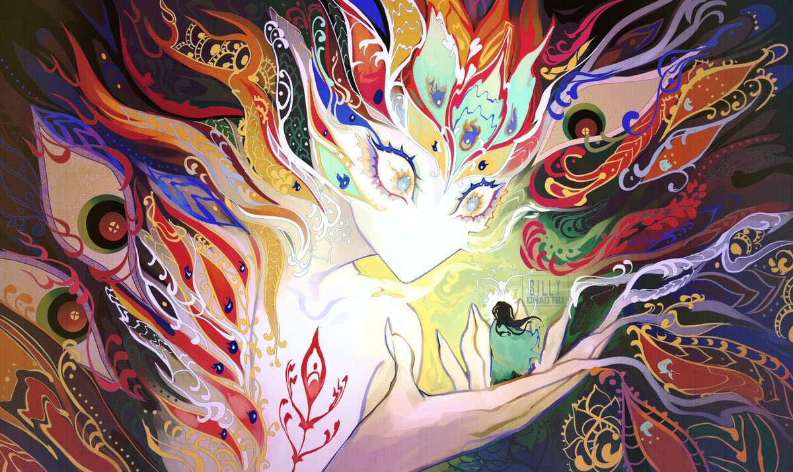

---
cssclasses:
  - pen-green
---
# Avaash
### Quick Facts

|                    |                                                                                   |
| ------------------ | --------------------------------------------------------------------------------- |
| First Appearance:  | [Session-28--Head-Like-a-Hole](../-Session-Notes/Session-28--Head-Like-a-Hole.md) |
| Based on:          | -                                                                                 |
| Played by:         | J                                                                                 |
| Full name:         | -                                                                                 |
| Nicknames:         | -                                                                                 |
| Gender & Pronouns: | Any/All                                                                           |
| Ancestry:          | [Daelkyr](../-Groups/Daelkyr.md)                                                  |
| Affiliation:       | Itself                                                                            |
| Tarot:             | -                                                                                 |
| Nationality:       | -                                                                                 |
***
### Personality & Appearance
Freaky.

***
### History
History about person.

***
### Relations
Controlled the [Mycology](../-Groups/Mycology.md).
Connected to [Cort](Cort.md) through the [1-Rotten-Heart](../-Elements-of-the-Prophecy/1-Rotten-Heart.md).

***
### Ability
Freaky Daelkyr powers, plants.

***
### Gallery

[CREDIT](https://www.instagram.com/silly_chaotic/)

[Ripe (With Decay) - Nine Inch Nails](https://youtu.be/HkrUlSKRQRo?si=ytjKI4sY1uFdRnrJ)

***
