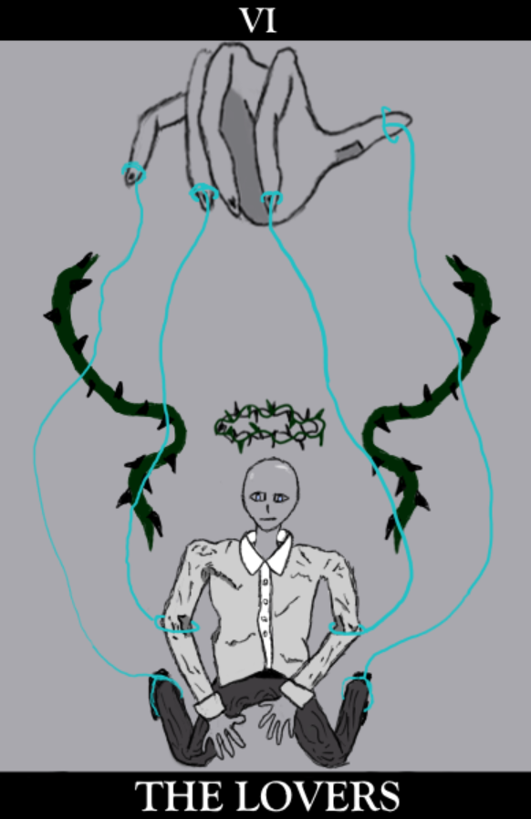
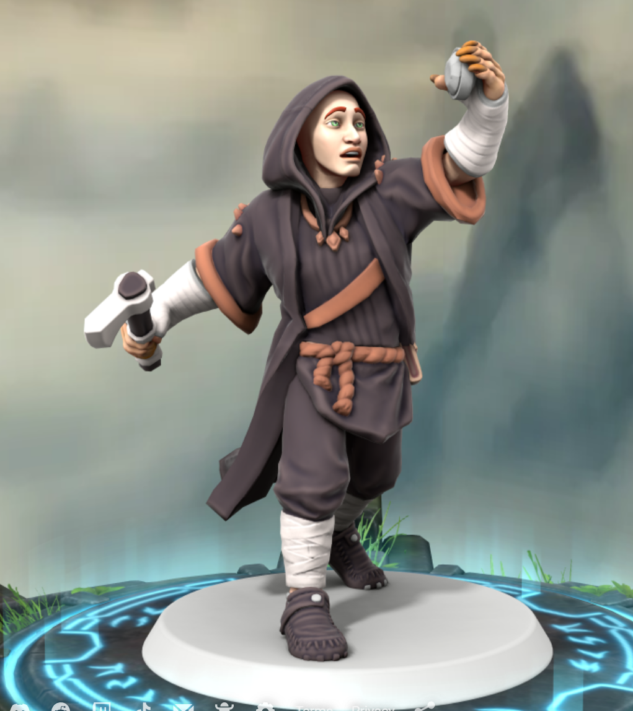

---
cssclasses:
  - pen-green
---
# Cort
### Quick Facts

|                    |                                                                                                                                     |
| ------------------ | ----------------------------------------------------------------------------------------------------------------------------------- |
| First Appearance:  | [Session-1--And-their-shadows-will spread-like-oil](../-Session-Notes/Session-1--And-their-shadows-will%20spread-like-oil.md) |
| Based on:          | Zombie Fungus                                                                                                                       |
| Played by:         | E                                                                                                                                   |
| Full name:         | Unknown (Former), Cortinarius Orell                                                                                                 |
| Nicknames:         | Cort, Gort                                                                                                                          |
| Gender & Pronouns: | Male, He/Him                                                                                                                        |
| Ancestry:          | Human (Former), Mushroom Thing                                                                                                      |
| Affiliation:       | [Rings-of-Harmony](../-Groups/Rings-of-Harmony.md), [The-Looking-Glass](../-Groups/The-Looking-Glass.md)                            |
| Tarot:             | The Lovers                                                                                                                          |
| Nationality:       | Eldeen Reaches (Former), Mycology                                                                                                   |
***
### General
Foolish, awkward, innocent, naive, gullible.
1. Human
2. Goes through cycles of life and death over 5 days.

***
### History
History about person.
Sacrificed his knowledge of his former life to [The-Forgotten-Prince](The-Forgotten-Prince.md).

***
### Relations
Manipulated by [Sisava](Sisava.md).
Influenced by [Avassh](Avassh.md) through the [Rotten Heart](../-Elements-of-the-Prophecy/1-Rotten-Heart.md)
Friends with [Duck](Duck.md).
Forgotten human relatives.
Related to a man who accidentally escalated [The Last War](https://eberron.fandom.com/wiki/Last_War)

***
### Ability
Mushroom abilities.

***
### Gallery

***
