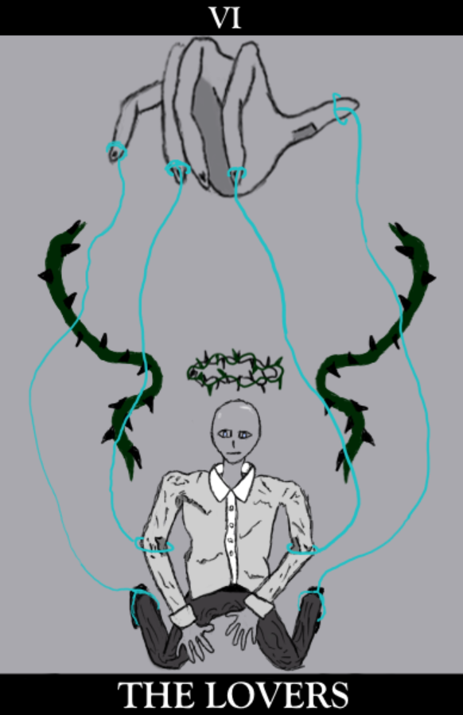
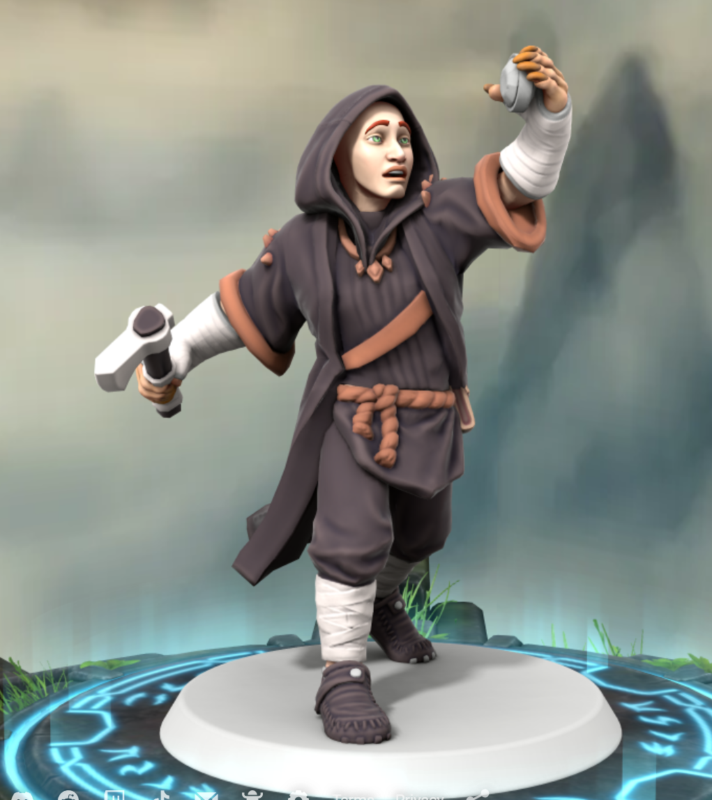

---
cssclasses:
  - pen-green
---
<link rel="stylesheet" href="https://cdn.jsdelivr.net/npm/rpg-awesome@latest/css/rpg-awesome.min.css">
<link rel="stylesheet" href="https://cdn.jsdelivr.net/npm/remixicon@4.5.0/fonts/remixicon.min.css"> 

# Cort <i class="ra ra-super-mushroom"></i>
### Quick Facts

|                    |                                                                                                                                                      |
| ------------------ | ---------------------------------------------------------------------------------------------------------------------------------------------------- |
| First Appearance:  | [Session-1--And-their-shadows-will-spread-like-oil](../../-Session-Notes/-1-Gathering-Storms/Session-1--And-their-shadows-will-spread-like-oil.md) |
| Inspiration:          | Zombie Fungus                                                                                                                                        |
| Full name:         | Unknown (Former), Cortinarius Orell                                                                                                                  |
| Nicknames:         | Cort, Gort                                                                                                                                           |
| Gender & Pronouns: | Male, He/Him                                                                                                                                         |
| Ancestry:          | Human (Former), Mushroom Thing                                                                                                                       |
| Affiliation:       | [Rings-of-Harmony](../../-Groups/Rings-of-Harmony.md), [The-Looking-Glass](../../-Groups/The-Looking-Glass.md)                                       |
| Tarot:             | The Lovers                                                                                                                                           |
| Nationality:       | Eldeen Reaches (Former), Mycology                                                                                                                    |
***
### General <i class="ri-checkbox-blank-line"></i>
Foolish, awkward, innocent, naive, gullible.
1. Human
2. Goes through cycles of life and death over 5 days.

***
### History <i class="ri-history-line"></i>
History <i class="ri-history-line"></i> about person.
Sacrificed his knowledge of his former life to [The-Forgotten-Prince](../The-Forgotten-Prince.md).

***
### Relations <i class="ri-user-line"></i>
Manipulated by [Sisava](Sisava.md).
Influenced by [Avassh](../Avassh.md) through the [Rotten Heart](../../Elements-of-the-Prophecy/1-Rotten-Heart.md)
Friends with [Duck](Duck.md).
Forgotten human relatives.
Related to a man who accidentally escalated [The Last War](https://eberron.fandom.com/wiki/Last_War)

***
### Ability <i class="ri-star-line"></i>
Mushroom abilities.

***
### Gallery <i class="ri-image-line"></i>

***
