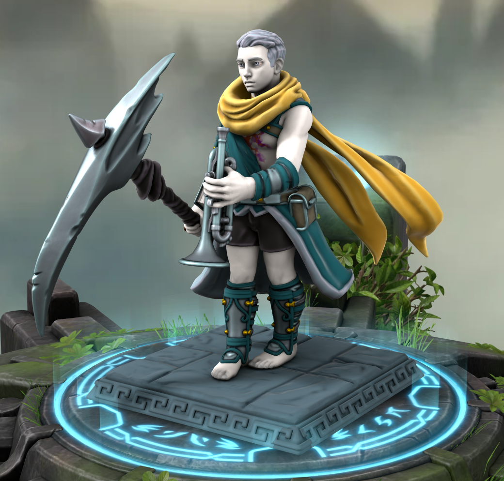
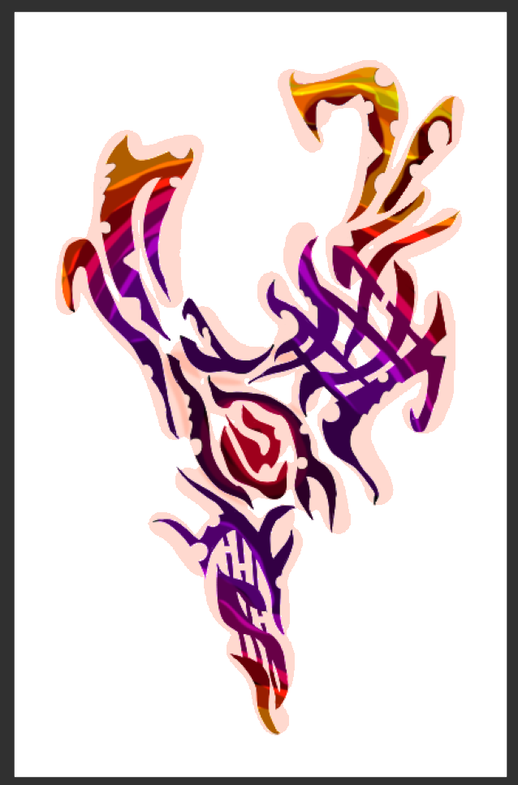

---
cssclasses:
  - pen-light-blue
---
<head>
<link rel="stylesheet" href="https://cdn.jsdelivr.net/npm/rpg-awesome@latest/css/rpg-awesome.min.css">
<link rel="stylesheet" href="https://cdn.jsdelivr.net/npm/remixicon@4.5.0/fonts/remixicon.min.css"> 
<link rel="stylesheet" href="/normalize.css">
</head>

# Duck <i class="ri-music-2-line"></i>
### Quick Facts

|                    |                                                                                                                                                    |
| ------------------ | -------------------------------------------------------------------------------------------------------------------------------------------------- |
| First Appearance:  | [Session-1--And-their-shadows-will-spread-like-oil](../../-Session-Notes/-1-Gathering-Storms/Session-1--And-their-shadows-will-spread-like-oil.md) |
| Inspiration:       | Invincible                                                                                                                                         |
| Full name:         | Lydian d'Cannith                                                                                                                                   |
| Nicknames:         | Duck, Prince Boy, Staedtler Fischer,                                                                                                               |
| Gender & Pronouns: | Male, He/Him (Variable)                                                                                                                            |
| Ancestry:          | [Changeling](https://eberron.fandom.com/wiki/Changeling)                                                                                           |
| Affiliation:       | [Rings-of-Harmony](../../-Groups/Rings-of-Harmony.md), [The-Looking-Glass](../../-Groups/The-Looking-Glass.md)                                     |
| Tarot:             | The Sun                                                                                                                                            |
| Nationality:       | Cyran                                                                                                                                              |
***
### General <i class="ri-checkbox-blank-line"></i>
Duck is a naive yet charming changeling, with extraordinary performance abilities.

He is empathetic yet self-absorbed, and usually very impulsive. He is obsessed with impressing other people.

While in his changeling form, Duck is average height, with somewhat lanky proportions. His skin is snow white and his hair is curly and ash-gray. His eyes often lack pupils. However, his form is subject to the desire of his shape-shifting abilities.

Duck's attire is a ['shiftweave'](https://eberron.fandom.com/wiki/Shiftweave) toga and waist cape, usually colored a deep Saxe blue. Duck's fashion sense is gaudy and extravagant, always manipulating his shiftweave to dress the part. Other common accessories include: a golden cape and sandals.

***
### History <i class="ri-history-line"></i>

 
	

	976 - 994 YK

	
 
	Duck is stupid 
	AA 
	write br after every line  
	The events of Session 60
	

	
1010 - 1015 YK

	
 
	Duck regained consciousness, with no memory but his nickname, in 1010 YK, and gained the affection of a struggling music-store owner, Staedtler Fischer. The two became close friends, and Duck began to support the store in exchange for a place to stay.

Duck learned the ins and outs of the music scene in [Sharn](https://eberron.fandom.com/wiki/Sharn.) and learned to stay hidden using personas sustained through his shape-shifting abilities. 

After garnering large audiences, some of Duck's popular elven personas caught the attention of [House Phiarlan](https://eberron.fandom.com/wiki/House_Phiarlan). Parasitical Relationships formed with the naive Duck until local conflict escalated between House Phiarlan and [House Thuranni](https://eberron.fandom.com/wiki/House_Thuranni). Duck's mentor was accidentally killed in the crossfire, and Duck presumed his identity to withdraw and protect himself.

Years passed and Duck subsisted on low-paying gigs and worship of [the Traveler](https://eberron.fandom.com/wiki/The_Traveler).
	

	
Present

	
 

Duck is introduced as Staedtler. 

In [Session 1](../../-Session-Notes/-1-Gathering-Storms/Session-1--And-their-shadows-will-spread-like-oil.md), Duck stumbles across Maylyn (neither recognize each other due to memory suppression by powerful [enchantment magic.](../../../-Sacrosanct/Machine-of-Enchantment.md)) 

She offers a job as an agent for the Looking Glass, which Duck accepts out of boredom and beliefs related to the Traveler. 

Duck learns to fight, incorporating his musical ability into inspiration for his peers.

In [Session 4](../../-Session-Notes/-1-Gathering-Storms/Session-4--Phantom-of-the-Opera.md), Duck finds a powerful musical artifact, [Phil](../../-Items/Phil.md), that responds only to his touch.

Duck's identity as a changeling is kept secret until [Session 10](../../-Session-Notes/-2-Shattered-Glass/Session-10--This-is-Where-it-All-Falls-Apart.md). 

Duck re-meets the forgotten prince in [Session 23](../../-Session-Notes/-5-Some-mistakes-you-never-stop-paying-for/Session-23--All-Along-the-Clocktower.md).

Duck manifests an [aberrant mark](https://eberron.fandom.com/wiki/Aberrant_dragonmark) in [Session 44](../../-Session-Notes/-7-Conquest/Session-44--Into-the-Hallow.md).

Duck's mask is permanently scarred by Phoen [Session 55](../../-Session-Notes/-8-War/Session-55--Schism.md)
    

 

***
### Relations <i class="ri-user-line"></i>

- Son of [Maylyn](../Maylyn.md) and [Tonik](../Tonik.md). (Revealed in [Session 43](../../-Session-Notes/-7-Conquest/Session-43--Something-I-Can-Never-Have-Degenerate-Pt.-2.md))
- In a Relationship with [Lorraine](../Lorraine.md).
- Pupil of [The Forgotten Prince](../The-Forgotten-Prince.md).
- Hated on by [Phoen](../Phoen.md).
	- Formerly best friends, unbeknownst to them.
- Pities [Cort](Cort.md).
- Is wary of [Sisava](Sisava.md).
- Respects [Pharen](Pharen.md).

***
### Ability <i class="ri-star-line"></i>

#### Shapeshifting 
As a changeling, Duck can take the form of any humanoid.
#### Magic 
Proficient in the occult, supporting allies with inspiration and healing while hindering opponents.
#### Maneuverability
Nimble, agile, and reflexive, Duck can move across the battlefield extremely quickly.
- Rocket sandals designed by Tonik allow quickened movement and the ability to fly for a short while.
- A golden scarf allows Duck to distract and reposition opponents, while granting him even more mobility.
#### Weapons
Duck is a graceful fighter, using finesse melee weapons.
* A magical spear that returns when thrown.
* Remembrance, a majestic scythe granted to him by the Forgotten Prince.
* Silence, a sentimental sword given to him by Rime, granted to him by the Prince of Frost.

#### Fey Influence
The Forgotten Prince protects Duck from death by taking control of his body in dire circumstances (represented by an ethereal mask).

The Forgotten Prince provides other supporting magic, indicated by tendril-like smoke.

#### Aberrant Mark
Caused due to being the child of a Sivis and Cannith, the mark indirectly channels Maylyn and her relation to The Fury. The mark is fuelled by feelings of rage and is satiated by retribution.

***
### Gallery <i class="ri-image-line"></i>

***
