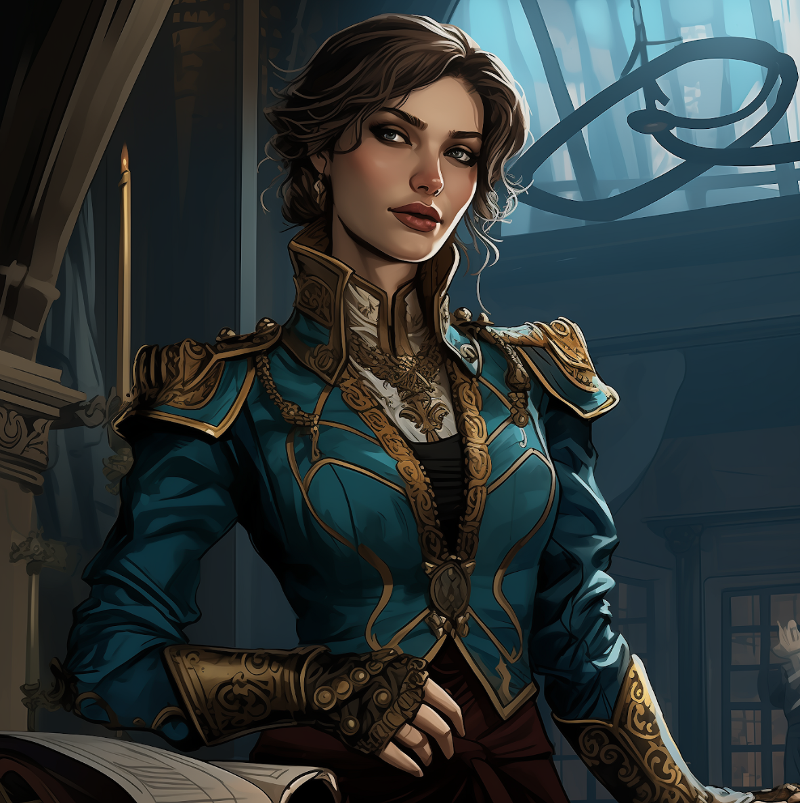

---
cssclasses:
  - pen-red
---
<link rel="stylesheet" href="https://cdn.jsdelivr.net/npm/rpg-awesome@latest/css/rpg-awesome.min.css"> 
<link rel="stylesheet" href="https://cdn.jsdelivr.net/npm/remixicon@4.5.0/fonts/remixicon.min.css"> 

# Aspectum <i class="ra ra-bleeding-eye"></i> 

 

<blockquote>
"Point proven."
</blockquote>

 

### Quick Facts

|                    |                                                                                                                                                                   |
| ------------------ | ----------------------------------------------------------------------------------------------------------------------------------------------------------------- |
| First Appearance:  | [Session 5: Dancing in Twilight](../Session-Notes/-1-Gathering-Storms/Session-5--Dancing-in-Twilight.md)                                                         |
| Inspiration:       | -                                                                                                                                                                 |
| Full name:         | Faalya d'Medani                                                                                                                                                   |
| Nicknames:         | Aspectum, The Lord of Eyes                                                                                                                                        |
| Gender & Pronouns: | Female, She/Her                                                                                                                                                   |
| Ancestry:          | [Khoravar](https://eberron.fandom.com/wiki/Half-elf)                                                                                                              |
| Affiliation:       | [House Medani](https://eberron.fandom.com/wiki/House_Medani) (Former),   [The-Looking-Glass](../Groups/The-Looking-Glass.md) (Former),   [Bella](Bella.md) |
| Tarot:             | The Fool                                                                                                                                                          |
| Nationality:       | [Brelish](https://eberron.fandom.com/wiki/Breland) (Former)                                                                                                       |
***
### General <i class="ri-checkbox-blank-line"></i>
Mischievous, maniacal, twisted, intelligent, cunning.

***
### History <i class="ri-history-line"></i>
Faalya worked closely with the Looking Glass.
She tricked the party into collecting a powerful artifact, the hand of the lady of the plague, and revealed her true intentions and servitude to Bella.

***
### Relations <i class="ri-user-line"></i>
Had an affair with [Rylan](Rylan.md) as a political stunt, both in the Arcanist political party.
Worked with [The Looking Glass](../Groups/The-Looking-Glass.md). (Former)
Student of [Bella](Bella.md).

***
### Ability <i class="ri-star-line"></i>
Has demonstrated the Ability <i class="ri-star-line"></i> to communicate through dreams and visions. Can open portals in-between realities. Extraordinary spell casting.

***
### Gallery <i class="ri-image-line"></i>

***
