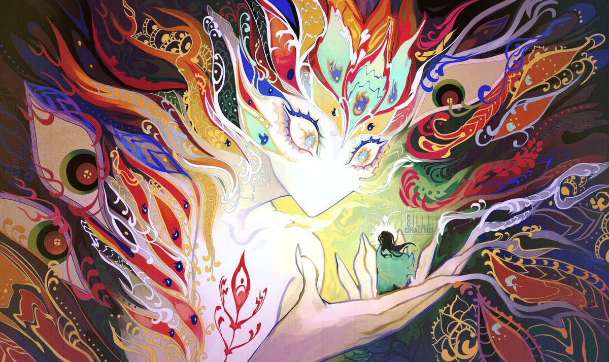

---
cssclasses:
  - pen-green
---
<link rel="stylesheet" href="https://cdn.jsdelivr.net/npm/rpg-awesome@latest/css/rpg-awesome.min.css">
<link rel="stylesheet" href="https://cdn.jsdelivr.net/npm/remixicon@4.5.0/fonts/remixicon.min.css"> 

# Avassh <i class="ra ra-dead-tree"></i>
### Quick Facts

|                    |                                                                                                                        |
| ------------------ | ---------------------------------------------------------------------------------------------------------------------- |
| First Appearance:  | [Session-28--Head-Like-a-Hole](../-Session-Notes/-6-Hand-me-my-shovel-we-are-going-in/Session-28--Head-Like-a-Hole.md) |
| Inspiration:          | [Eberron: Avassh](https://eberron.fandom.com/wiki/Avassh)                                                              |
| Full name:         | -                                                                                                                      |
| Nicknames:         | -                                                                                                                      |
| Gender & Pronouns: | Any/All                                                                                                                |
| Ancestry:          | [Daelkyr](../-Groups/Daelkyr.md)                                                                                       |
| Affiliation:       | Itself                                                                                                                 |
| Tarot:             | -                                                                                                                      |
| Nationality:       | Eldeen Reaches                                                                                                         |
***
### General <i class="ri-checkbox-blank-line"></i>
Avassh is based off of official Eberron Lore.
Avassh is known as the 'Twister of Roots,' and controls the 

***
### History <i class="ri-history-line"></i>
History <i class="ri-history-line"></i> about person.

***
### Relations <i class="ri-user-line"></i>
Controlled the [Mycology](../-Groups/Mycology.md).
Connected to [Cort](-Player/Cort.md) through the [Rotten Heart](../-Elements-of-the-Prophecy/1-Rotten-Heart.md).

***
### Ability <i class="ri-star-line"></i>
Freaky Daelkyr powers, plants.

***
### Gallery <i class="ri-image-line"></i>

[CREDIT](https://www.instagram.com/silly_chaotic/)

[Ripe (With Decay) - Nine Inch Nails](https://youtu.be/HkrUlSKRQRo?si=ytjKI4sY1uFdRnrJ)

***
