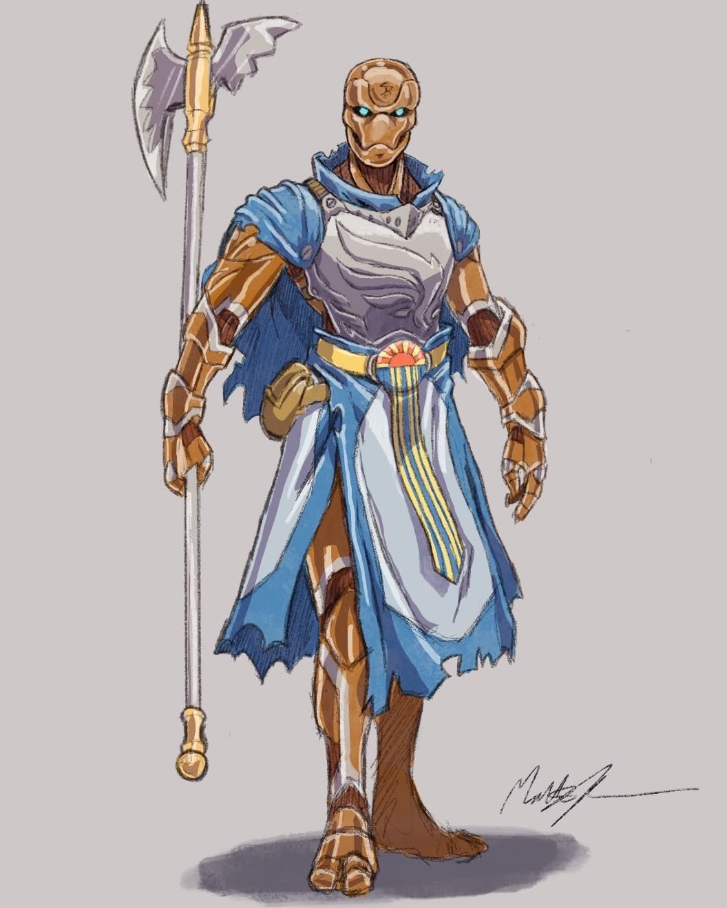

---
cssclasses:
  - pen-gray
---
<link rel="stylesheet" href="https://cdn.jsdelivr.net/npm/rpg-awesome@latest/css/rpg-awesome.min.css">
<link rel="stylesheet" href="https://cdn.jsdelivr.net/npm/remixicon@4.5.0/fonts/remixicon.min.css"> 

# Dynamo :RaHospitalCross:
### Quick Facts

|                    |                                                                                                           |
| ------------------ | --------------------------------------------------------------------------------------------------------- |
| First Appearance:  | [Session-5--Dancing-in-Twilight](../Session-Notes/-1-Gathering-Storms/Session-5--Dancing-in-Twilight.md) |
| Inspiration:          | -                                                                                                         |
| Full name:         | Dynamo                                                                                                    |
| Nicknames:         | Traitor                                                                                                   |
| Gender & Pronouns: | Male-Presenting, He/Him                                                                                   |
| Ancestry:          | Warforged                                                                                                 |
| Affiliation:       | [Rings-of-Harmony](../Groups/Rings-of-Harmony.md) (Former), Making                                       |
| Tarot:             | -                                                                                                         |
| Nationality:       | Making, Cyre                                                                                              |
***
### General <i class="ri-checkbox-blank-line"></i>
Words about person.
Southern accent.
***
### History <i class="ri-history-line"></i>
Dead.

***
### Relations <i class="ri-user-line"></i>
Relations <i class="ri-user-line"></i> with person.

***
### Ability <i class="ri-star-line"></i>
Religious. Axe really hard.

***
### Gallery <i class="ri-image-line"></i>

CREDIT UNKNOWN

***
