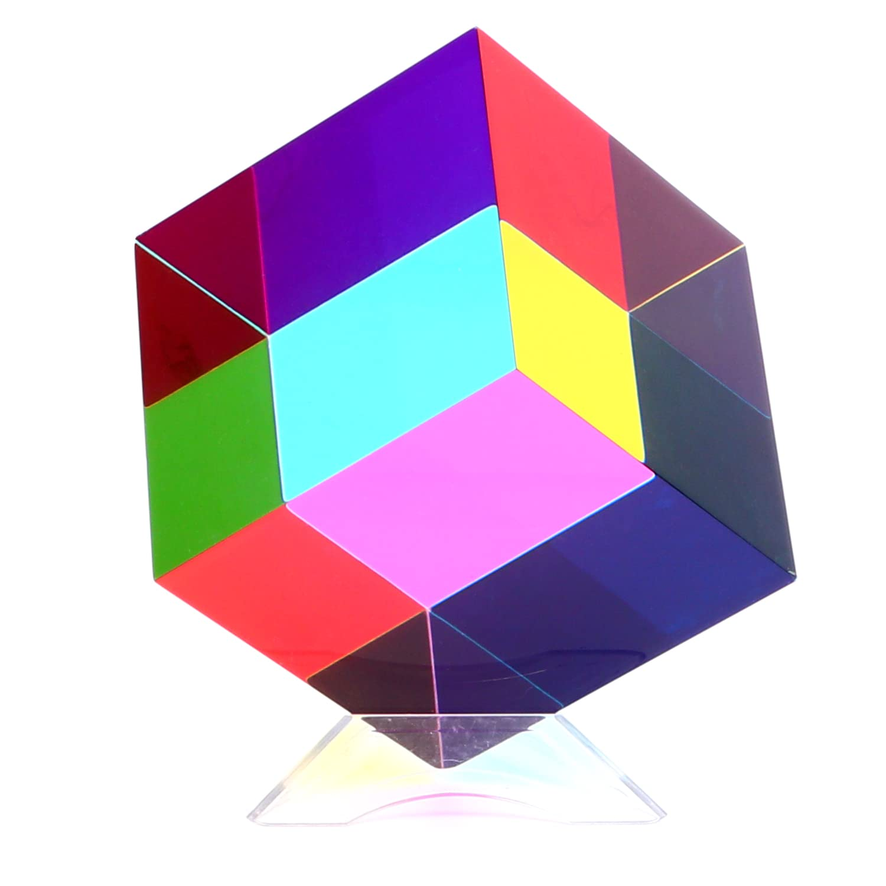

# The Cube 
## Description
An artifact created by [The Cohesion](../../-Sacrosanct/The-Agency-of-Cohesiveness.md) before 1000 YK. It is destroyed in the [Restoration](../Magic-Restoration.md) and is therefore not present in the primary timeline.

## Retrieval
[Session 64](../Session-Notes/-9-Famine/Session-64-Unfinished-Sympathy.md)

