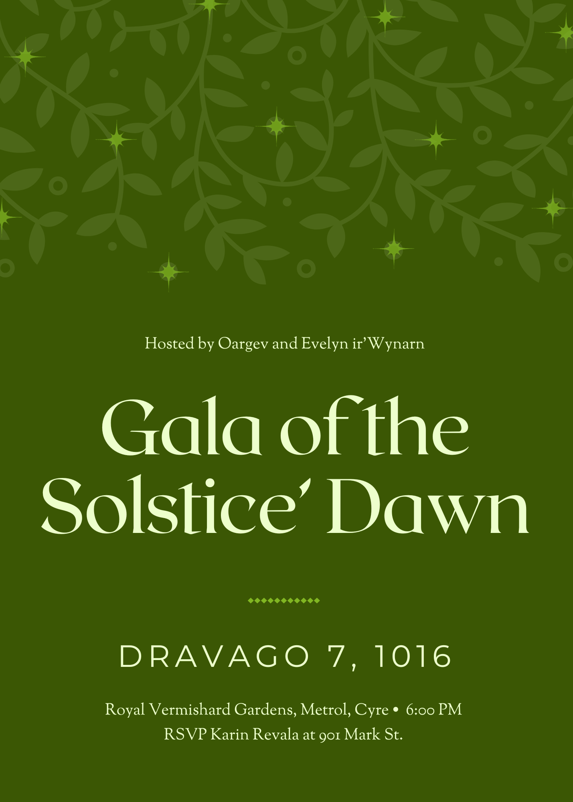

---
cssclasses:
  - daily
  - friday
---
# Famine
***
#### Tarot: The Fool, Reversed
***
## Synopsis
- Short convo between [Duck](../../Characters/-Player/Duck.md) and [Tonik](../../Characters/Tonik.md), another between [Pharen](../../Characters/-Player/Pharen.md) and [Varliae](../../Characters/-Pharen-Family/Varliae.md).
- Dhakaani travel to [Eston](../../Locations/Eston.md).
- Duck notes on Phoen's armor to improve own Ability <i class="ri-star-line"></i>.
- [Sisava](../../Characters/-Player/Sisava.md) does the ritual with [Phoen](../../Characters/Phoen.md)'s body.
- [Vrennan](../../Characters/Vrennan.md) leaves for the break.
***
- [Cort](../../Characters/-Player/Cort.md) manipulates his connection with Lharvion, making it more "productive" rather than disturbing. Melts the [Xoriat-Lens](../../Objects/Xoriat-Lens.md) into a champagne fluke.
- Talks to [Ghost](../../Characters/Ghost.md), who is overwhelmed with the paperwork required for rebuilding Making, and assists him.
- Dreams of [Avassh](../../Characters/Avassh.md), who burns, revealing a wax form of the [The-Feeling-of-Being-Stabbed](../../Characters/The-Feeling-of-Being-Stabbed.md), who tears the [1-The-Corruption](../../Elements-of-the-Prophecy/1-The-Corruption.md) out. Cort feels immense elation and is ignited. Swears to see the [4-The-Heart](../../Elements-of-the-Prophecy/4-The-Heart.md) being shoved inside.
- Cort speaks to [Rusty](../../Characters/Rusty.md) about [Daelkyr](../../Groups/Daelkyr.md), invites to the upcoming gala.
***
- Pharen puts in orders to construct a large cannon to the [Rings-of-Harmony](../../Groups/Rings-of-Harmony.md). 
- Pharen travels to [Farlnen](../../Locations/Farlnen.md), bringing [Savia](../../Characters/-Pharen-Family/Savia.md), who will be there to stay.
- Pharen's family moved into the palace. [Varya](../../Characters/-Pharen-Family/Varya.md) is exhausted with the roles of being the active king. [Lady-Illmarrow](../../Characters/-Pharen-Family/Lady-Illmarrow.md) has not communicated when or if she will return.
- Pharen and Savia agree to marry after this whole 'saving the world' business is complete.
- Pharen buys an air-elemental skiff.
***
- Sisava talks to Tonik and upgrades their eye and gun.
- Heads to [Sharn](../../Locations/Sharn.md), cult affiliation has grown significantly thanks to [Strife](../../Characters/Strife.md).
- Sisava and Strife travel to other cities to expand the cult.
***
- Duck talks to Tonik, who is lining their room on the ship with lead to protect against psychic influence.
- After Tonik leaves, Duck rifles through his stuff finding [Maylyn](../../Characters/Maylyn.md)'s journal. It contains contingency plans to destroy each member of the [Rings-of-Harmony](../../Groups/Rings-of-Harmony.md) written by Tonik.
- Does a ritual for the Fury, burning [Aspectum](../../Characters/Aspectum.md)'s name and wax onto arms.
- Visits [The-Forgotten-Prince](../../Characters/The-Forgotten-Prince.md), confirms that [Rime](../../Characters/Rime.md) is going to Thelanis. Prince says to stay with the ship while Rime retrieves the [Clock-Hand](../../Objects/Clock-Hand.md).
- Visits [Lorraine](../../Characters/Lorraine.md).
***
## Gala of the Solstice Dawn

- Hosted by the Cyran monarchs.
- Dress:
	- Cort: Wrapped in thorns.
	- Pharen: Black and red bark-like suit.
	- Sisava: Flowing, desaturated, shiny, blue suit with rock ornaments.
	- Duck: Shifting green and yellow toga.
- [Chris](../../../-Sacrosanct/Characters/Chris.md), [Aaron](../../../-Sacrosanct/Characters/Aaron.md), [Tonik](../../Characters/Tonik.md), [Daren](../../../-Sacrosanct/Characters/Daren.md), [Strife](../../Characters/Strife.md), [Duul](../../Characters/Duul.md), [Savia](../../Characters/-Pharen-Family/Savia.md), [Lorraine](../../Characters/Lorraine.md), [Vrennan](../../Characters/Vrennan.md), [Evelyn](../../../-Sacrosanct/Characters/Evelyn.md), are all there.
- [Duul](../../Characters/Duul.md) with a large unknown Ghoul'dar.
- Long funny conversation with all.
***
- Briefing with Evelyn, party will head to [Nymm](../../Locations/Nymm.md).
- Vrennan does not explode on the launch, he is very depressed.
- Duck dreams and communicates with [Aspectum](../../Characters/Aspectum.md), who says he is the only one with a conscious.
- Duck talks to Cort about whether the party is moral.
- Party talks to [The-Taste-of-Tapioca](../../Characters/The-Taste-of-Tapioca.md).
- Offers [The-Feeling-of-Being-Stabbed](../../Characters/The-Feeling-of-Being-Stabbed.md) the [4-The-Heart](../../Elements-of-the-Prophecy/4-The-Heart.md), [3-The-Armor](../../Elements-of-the-Prophecy/3-The-Armor.md), Cort, and Pharen. It doesn't take them.
- Told the next artifacts to collect: **Tome, Crystal, Cube, Empire.** Return after collecting 5th and 6th because we will need help to collect the 7th.
- Cort tells FBS about the dream. FBS reminds Cort that he will either be a puppet, a weapon, or nothing.
- Party goes to [Cygnus](../../Characters/Cygnus.md).

#### Theories
* [5-The-Tome](../../Elements-of-the-Prophecy/5-The-Tome.md) is a grimoire related to Pharen in Dravago
* [6-The-Crystal](../../Elements-of-the-Prophecy/6-The-Crystal.md) is related to Rime and Vrennan, get Rime back
* [7-The-Cube](../../Elements-of-the-Prophecy/7-The-Cube.md) is related to alternate universe, Neo Sharn
* [8-The-Empire](../../Elements-of-the-Prophecy/8-The-Empire.md) a failed Kehk.